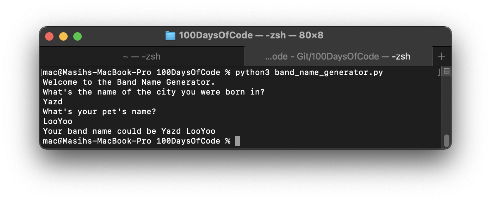

# 100 Days of Code

Embarking on a journey to master development, specifically Python, to delve into data science, automation, website building, game and app development. Here's the record of my progress:

## Day 1
- Explored Python's parsing mechanism. For instance, in the following code, Python evaluates the inner `input()` function first:
  ```python
  Print("Hello " & Input("What is your " & Input("What data do you want to share with me? Name or NickName?" & vbCrLf) & "? " & vbCrLf) & "!")
   
   

- Gained an understanding of mathematical and conditional operations.
- Learned about error handling.
- Discovered how to define variables of various types and convert between these types.
- Acquired knowledge of basic built-in functions like `random.randrange(a, b)`, `round()`, etc.
- Created a sample program, the 'Tip Calculator'.

## Day 0
- Set up my development environment, including VSCode and Python installation.
- Configured Git on the terminal to enable pushing my first commit. The command used:
  ' git remote set-url origin https://<token>@github.com/<username>/<repo>
  ' after cloning the repository I had created on GitHub.
- Successfully inserted the first image into this README.md file.

- Understood the difference between single quotes (`\'`) and double quotes (`\"`).
- Learned how to capture user input and assign it to a variable.
- Mastered commenting out lines of code.
- Familiarized myself with the command to push to the main branch on GitHub:
  ' git push -u origin main
  ' and learned that pushing to `master` instead of `main` requires a merge request.


# 100DaysOfCode
I am trying to learn development

Day 1:
- while python is parsing, it will get the inner part at first, look at this part of code: 
```print("Hello " + input("What is your " + input("What data do you want to share with me? Name or NickName?\n") + "? \n") + "!")
```

- I realized how to use meathematical and conditional operations.
- I know something bout error handling
- I know how to define variables in various types
- I have learnt how to transfer types to each others
- I have learnt use some basic predefined function such as random.randrange(a,b), round(), etc.
- I have written a sample program named tip calculator 

Day 0:
- I have intalled needed tools, I mean VSCode and Python.
- I config my git on terminal to push my first commit using this command: ``` git remote set-url origin https://<token>@github.com/<username>/<repo>``` after cloning the repository which I had created on Github.
- I could insert the first image to this Readme.md file
- I ran the first code of mine here:

- Now I know differences between \' and \"
- I know how to give an input from user and assign it to a variable.
- Now I can change a line of code to comment, which is not executed.
- I know the comman to push to main branch on github: ```git push -u origin main``` and now I know if I push to *master* instead of *main*, it will need a merge request